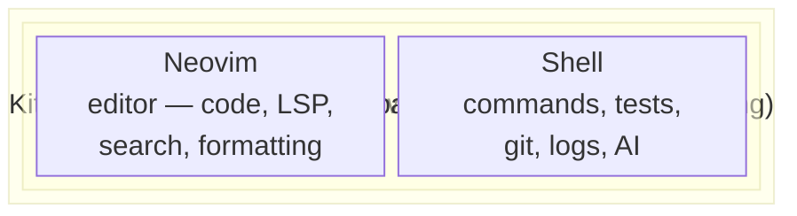
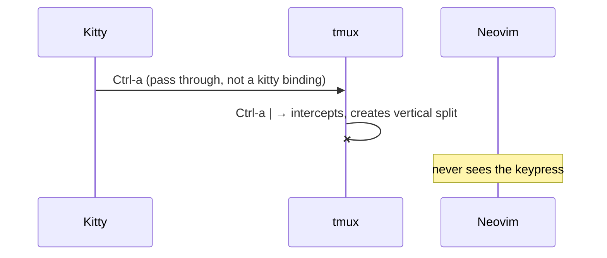
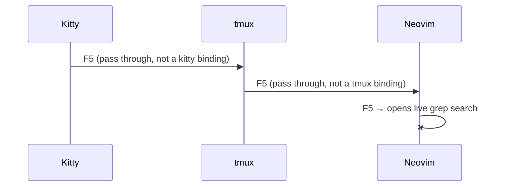
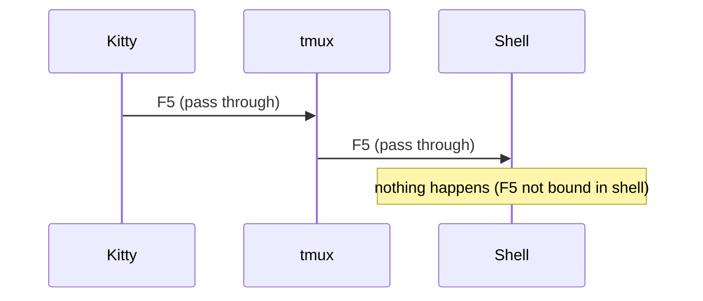

# Chapter 2: Mental Model

The setup makes the most sense once you see the layers clearly.

## What You Should Get From This Chapter

By the end of this chapter, you should understand which tool is responsible for
which part of your day so you do not feel like three tools are competing for the
same job.

## The Three Layers

Each layer wraps the one inside it. They do not overlap.

## Kitty

Kitty is the outer terminal app.

Use it for:

- OS windows
- tabs
- quick splits
- GPU-accelerated rendering

Kitty is where your terminal session lives visually. It is the building.

## Tmux

Tmux is the persistent workspace manager.

Use it for:

- long-lived sessions (one per repo)
- repo-specific workspaces
- side-by-side panes
- resuming work after closing kitty, sleeping your laptop, or disconnecting SSH

If kitty is the building, tmux is the floor plan. It survives when kitty
closes. That is the key distinction.

Prefix: `Ctrl-a`

The bindings you need first:

| Keys          | Action             |
|---------------|--------------------|
| `Ctrl-a \|`  | split vertically   |
| `Ctrl-a -`   | split horizontally |
| `Ctrl-a c`   | new window         |
| `Ctrl-a h/j/k/l` | move between panes |
| `Ctrl-a z`   | zoom current pane  |
| `Ctrl-a r`   | reload tmux config |

## Neovim

Neovim is the editor inside the workspace.

Use it for:

- editing
- search (F5 grep, F6 files)
- file navigation (F8 explorer)
- LSP features (F2 rename, F4 code action)
- formatting (F3)
- diagnostics
- git review (F10 LazyGit)

If tmux manages context, Neovim manages code.

## Layers In Action

Here is what happens when you press a key, depending on where you are:

**You press `Ctrl-a |` (tmux prefix + split)**

**You press `F5` in the Neovim pane**

**You press `F5` in the shell pane**

The layers are strict. Each one only intercepts what it owns. If a keypress is
not bound at a layer, it falls through to the next one. This is why the same
keyboard can control three tools without conflict.

## The Default Daily Shape

1. Open kitty
2. Run `dev`
3. Pick a repo
4. Attach to its tmux session
5. Edit in the left pane
6. Use the right pane for commands, git, tests, and AI

That is the main loop.

## The One Thing To Remember

If you only remember one thing from this chapter, remember this:

- kitty opens the environment
- tmux holds the environment
- Neovim edits inside the environment

Once that distinction is clear, the rest of the setup follows naturally.
